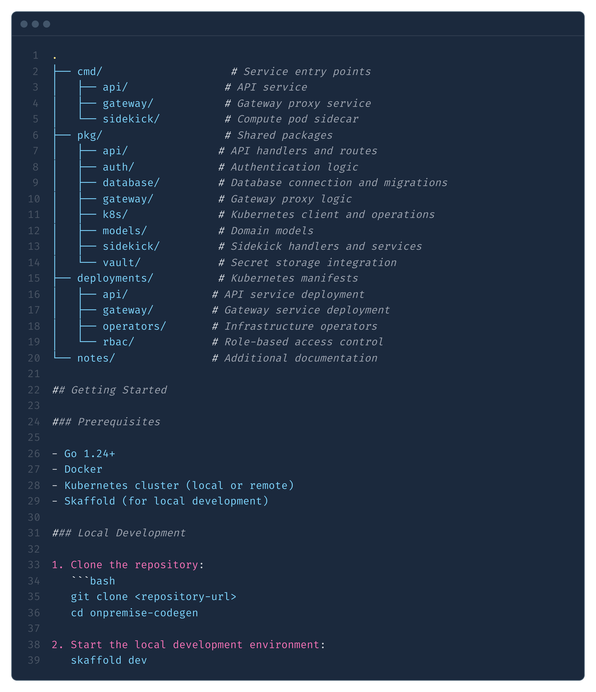

import PricePanel from '../../components/PricePanel.astro';
import { Card, CardGrid } from '@astrojs/starlight/components';
import { Code, CodeTabItem, CodeTabs, CodeFile } from 'starlight-theme-nova/components'

export const exampleCode = `go build -o bin/api ./cmd/api`;
export const fileName = 'main.go';
export const highlights = ['file', 'bin', 'api'];

      {/* Price Panel */}
      

        <PricePanel />
      

  

    

      {/* Main content */}
      

        <section class="prose dark:prose-invert max-w-none">
          
          

            <h2>Features</h2>
            <CardGrid>
              <Card title="Check this out">
                Interesting content you want to highlight.
              </Card>
              <Card title="Other feature">
                More information you want to share.
              </Card>
              <Card title="Check this out">
                Interesting content you want to highlight.
              </Card>
              <Card title="Other feature">
                More information you want to share.
              </Card>
            </CardGrid>
          

          <h2>Sample Image</h2>
          

            
          

          <h2>Example Code</h2>

          

            <Code lang="go" code={exampleCode} title={fileName} mark={highlights} />
          

    
          <h2>Example Code Tabs</h2>

          

            <CodeTabs>
            <CodeTabItem
                label="main.go"
                lang="go"
                code={`go build -o bin/api ./cmd/api`}
            />
            <CodeTabItem
                label="main.ts"
                lang="ts"
                code={`function (): void {\n  console.log('Hello, TS!')\n}`}
            />
            </CodeTabs>
          

          <h2>Example Code Block</h2>
          

            <CodeFile path="package.json" />
          

        </section>
      

      {/* Price Panel */}
      

        <PricePanel />
      

    

  

{/* Styling is now in global.css */}
